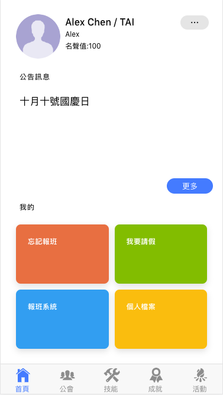
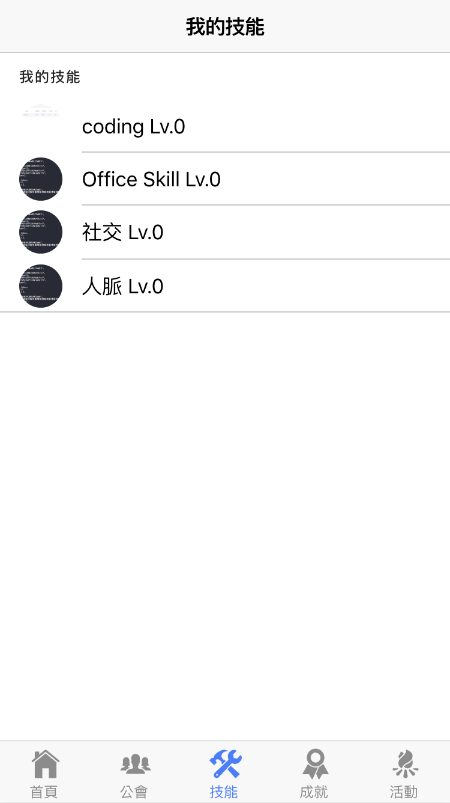
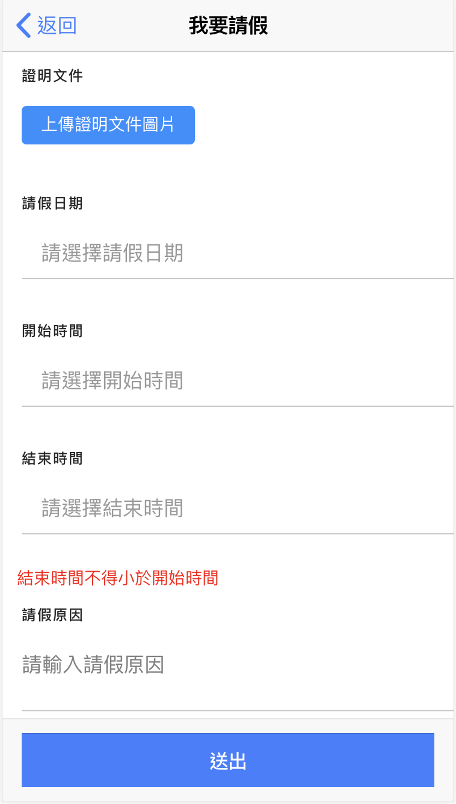
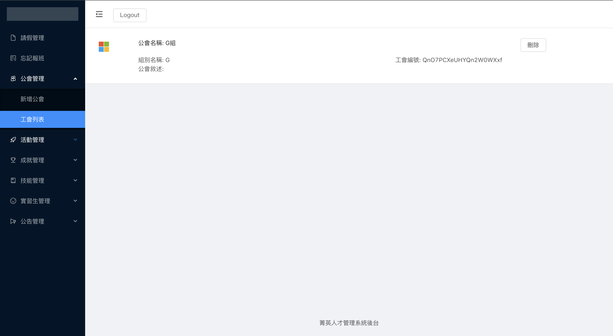
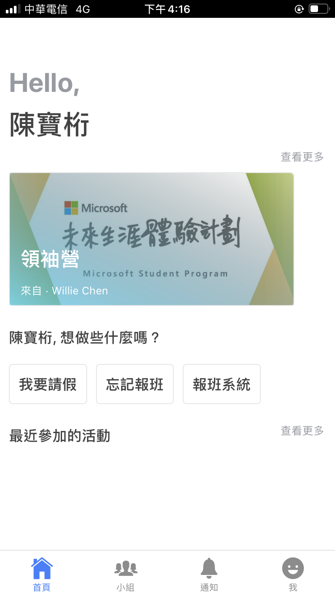
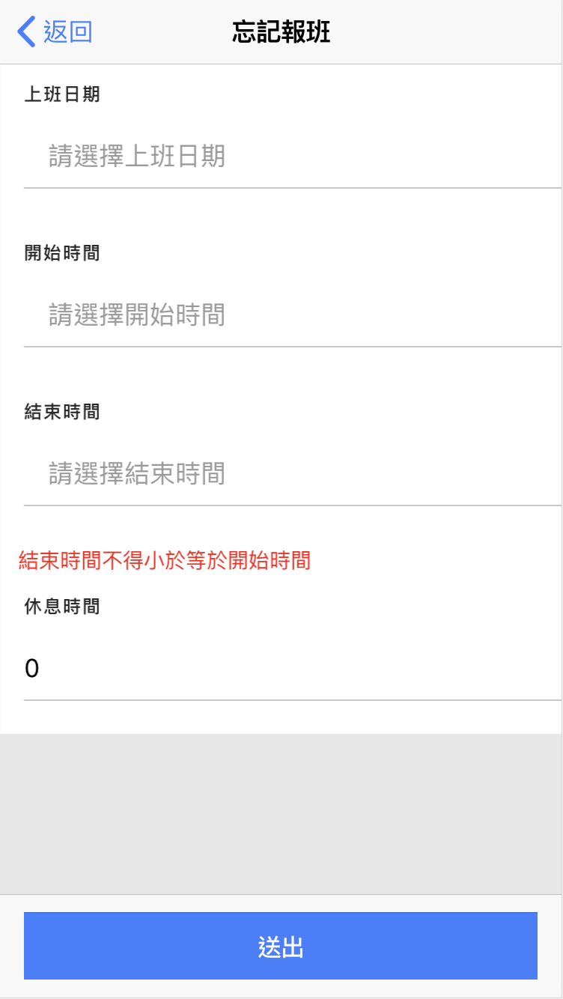
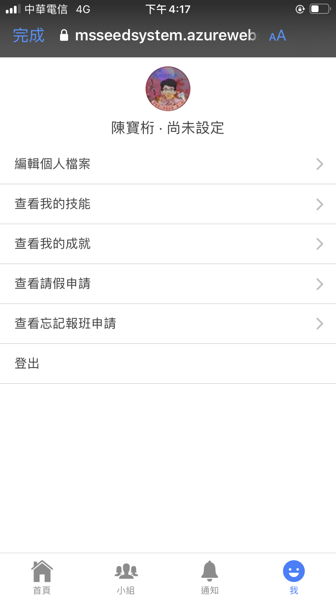
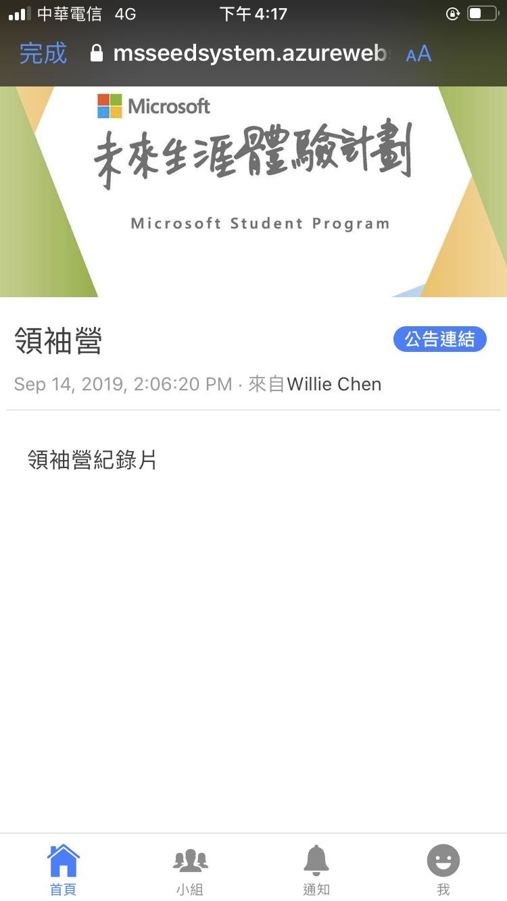

在實習期間，我接受實習計畫的主管的委託和同事一起腦力激盪出一個可以提供實習生們紀錄實習生活並提高實習生參與活動意願的 web app - 菁英人才孵化器。
這個 Web app 有兩次的迭代，第一版使用的是 Vue.js 搭配 Firebase realtime database 開發，在開發中因為 real time database 無法儲存資料庫中另一個文件的 reference 而吃了許多苦頭，不過最後也成功地將第一版交付測試。
後來因為 firebase 推出了 Cloud firestore 的功能便決定修相關的邏輯使用 Cloud firestore
，其中也因為考慮到開發速度及穩定性便使用 Angular 搭配 Ionic framework 進行使用者端的開發，
並且將匯入實習生資料的功能利用 Cloud functions 撰寫。

#### 負責：

1. 使用 Angular 及 Vue 建立 Mobile Web app，及管理者介面。
2. 將匯入實習生資料的程式包裝成 Cloud Functions。
3. 設計 Mobile Web app 及管理者介面 UI/UX。

#### 使用技術：

1. Vue2: 作為第一版的前端開發框架，利用 Vuex 做全局狀態管理。
2. Angular: 搭配 Ionic framework 及 NG-Zorro 加快網站開發速度，使用 Router Guard 在前端進行權限驗證並阻擋沒有權限的使用者進入頁面。
3. Firebase: 使用 authentication 作為登入認證服務簡化開發流程，利用 Realtime database/Cloud firestore 作為資料庫，並建立 Cloud functions 將批次上傳資料的工作包裝為 api。

#### 作品截圖：

###### 第ㄧ版使用者介面

###### 第一版管理者介面

###### 第二版使用者介面

