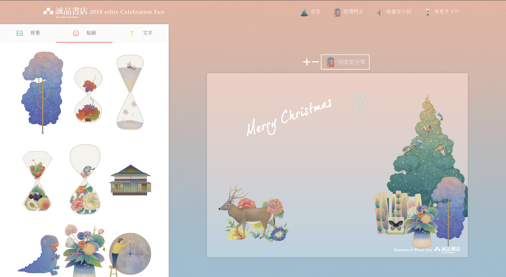
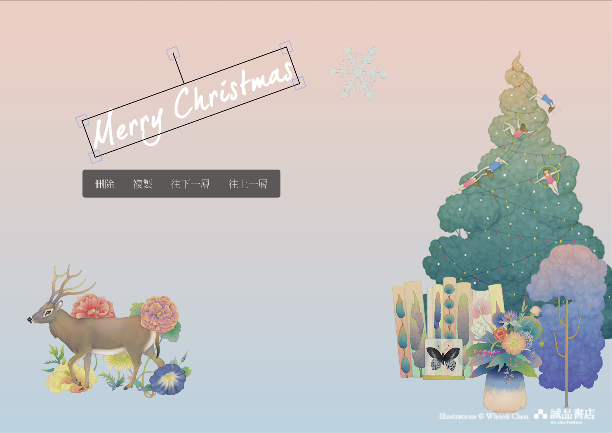
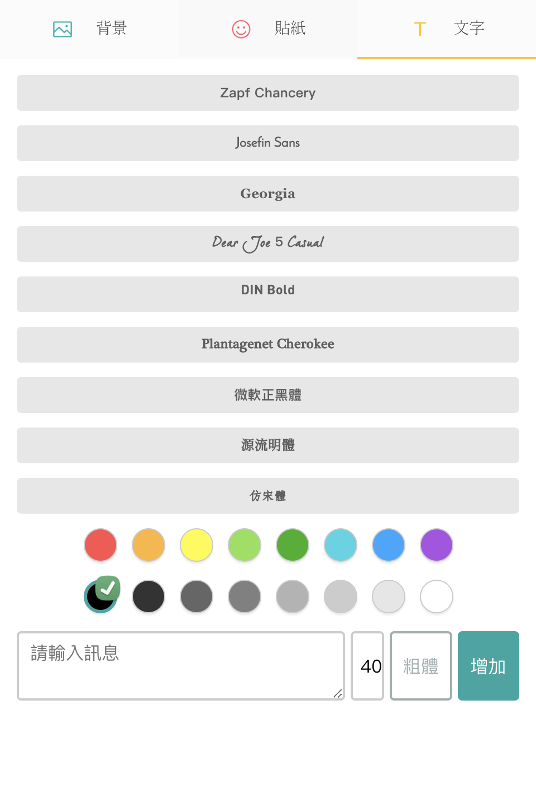
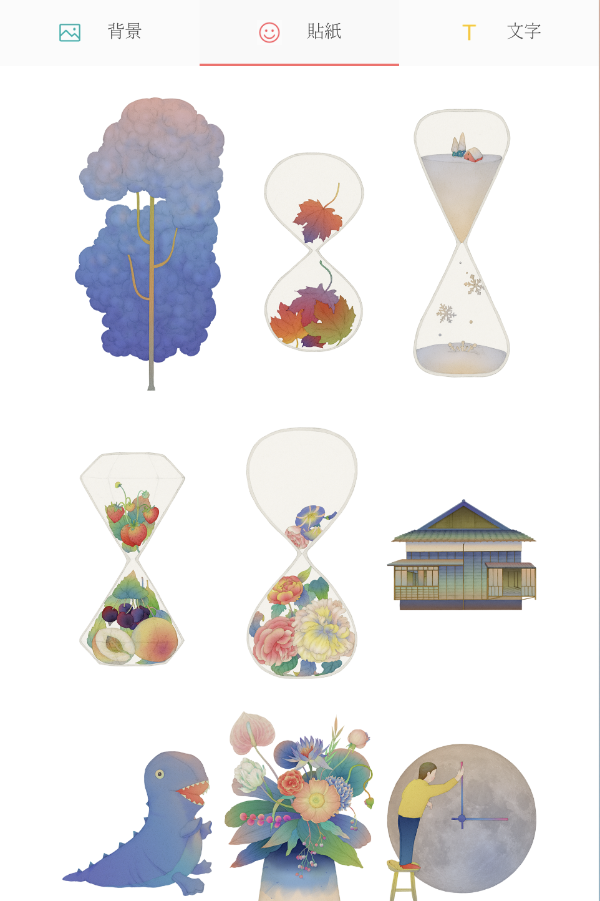

2018 Eslite XMAS Card 是我在學生時期一起和同學與誠品書店合作的專案，
誠品書店希望可以讓任何人使用誠品與合作插畫家-陳狐狸的素材製作聖誕賀卡，並分享卡片取得書店優惠卷。
為了達成這個目的便委託我們建立一個 DIY 卡片網站，使用者可以藉由拖曳的方式排放素材位置。
並利用我們製作的控制項移動素材圖層，文字字體，或是更換卡片樣式，在活動期間，本網站使用人次達到 1.2 萬人

###### 負責：

1. 專案初始化及相關技術調查。
2. RWD 設計，確認使用者在手機、平板、電腦等螢幕大小都能夠方便的自製聖誕賀卡。
3. 使用 React 及 Fabric.js 建立網站。

###### 使用技術：

1. React: 用於作為網站的前端框架，並整合 Fabric.js。
2. Fabric.js: 提供卡片製作功能多樣的 Html Canvas API，並簡化開發時間。

###### 作品截圖：

