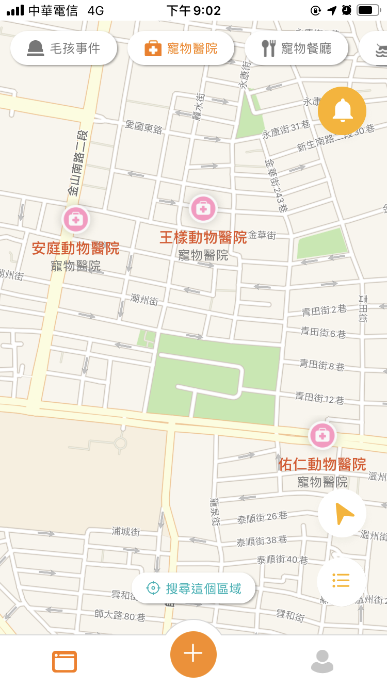
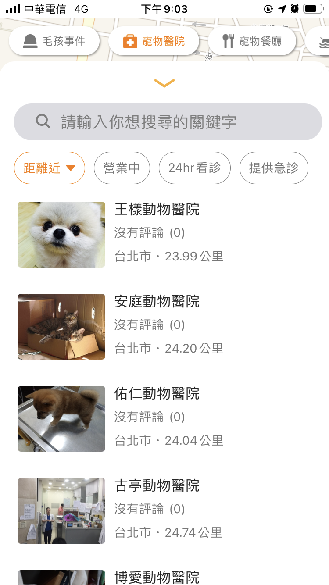
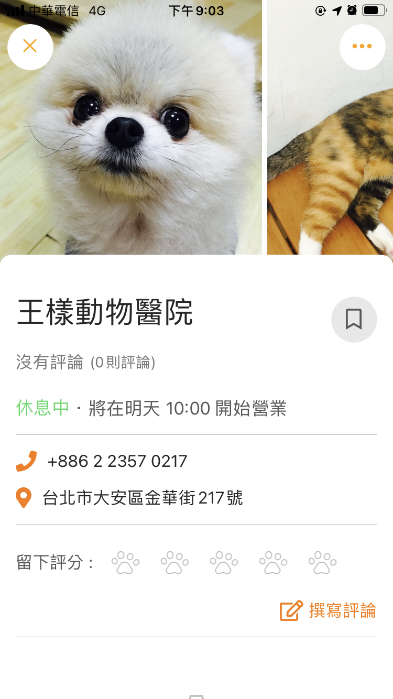
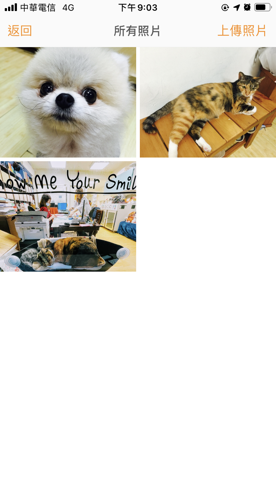
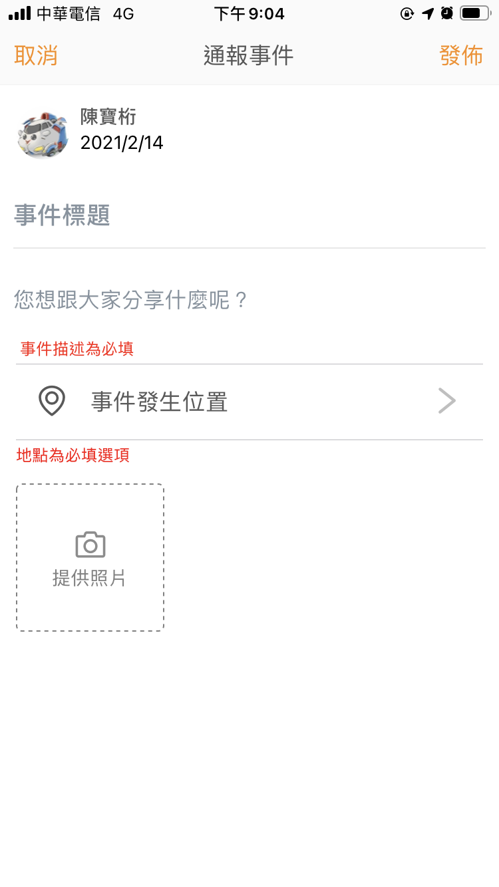
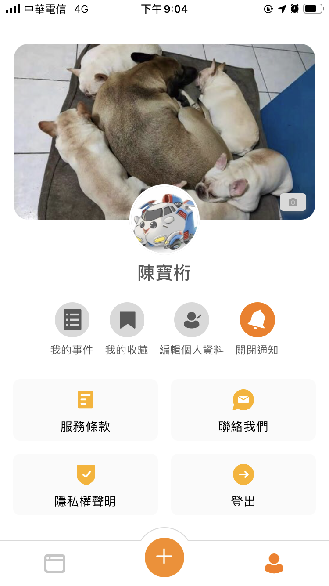

Furmap 毛孩地圖是我和幾個大學同學一起利用閒暇之餘開發的寵物資訊整合 App，
有鑒於許多寵物相關資訊都散落在臉書的各大寵物社團中，例如：推薦的寵物友善地點、附近的寵物危害事件、寵物走失......等。
我們認為如果能夠整合這些資訊一定可以減少寵物飼主的負擔，
未來也希望可以加入社群的功能，建立一個具備所有資訊的寵物社群，目前已在 google play 及 app store 上架。

#### 負責：

1. 從零開始規劃及開發後端及 App 程式，並在後端導入單元測試提高程式碼品質。
2. 使用六角架構將原先存在 controller 中的大量程式碼分別移入 application service 及 domain service 層。
3. 在前端封裝 Axios，並使用 http interceptor 在 request 發送前統一加入後端需要的 header，並統一管理 http response 的錯誤處理。

#### 使用技術：

1. React-Native: 作為跨平台 App 開發框架，搭配 redux 及 react hook 來建構程式碼 。
2. Nest.js: 用於開發後端服務搭配 Passport.js 建立 signIn with Facebook/Apple 的客製化認證。並串接 Firebase Cloud Message 提供後端發送推播的能力，使用 Typescript 及 Jest 做單元測試，搭配六角架構針對程式架構優化。
3. Azure: 利用 AKS、Azure cache for redis...等服務建立可以 Auto scale up/scale out 的後端服務。

#### 作品截圖：

