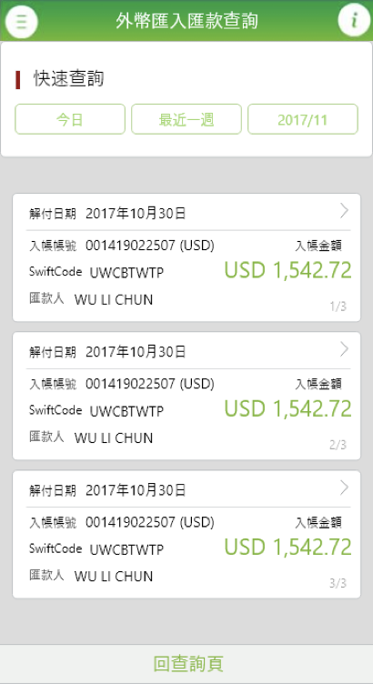
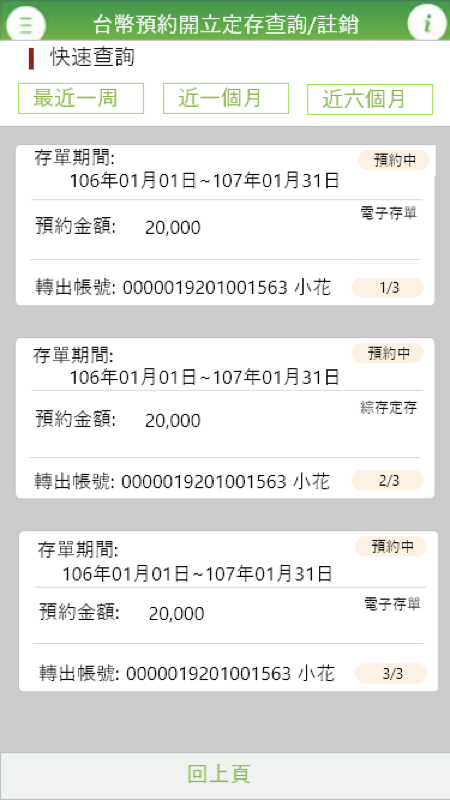
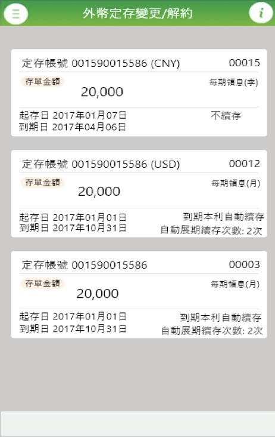
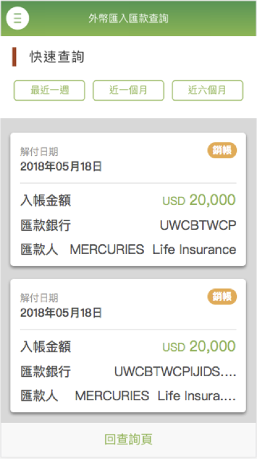
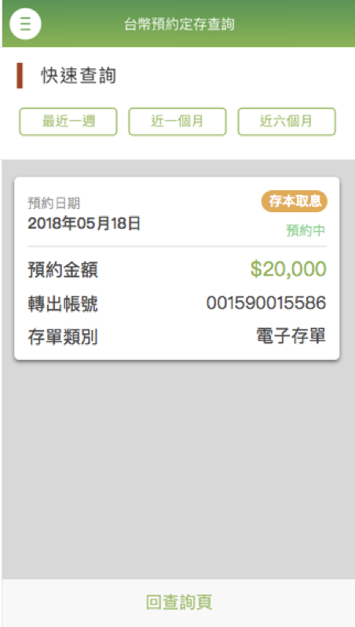
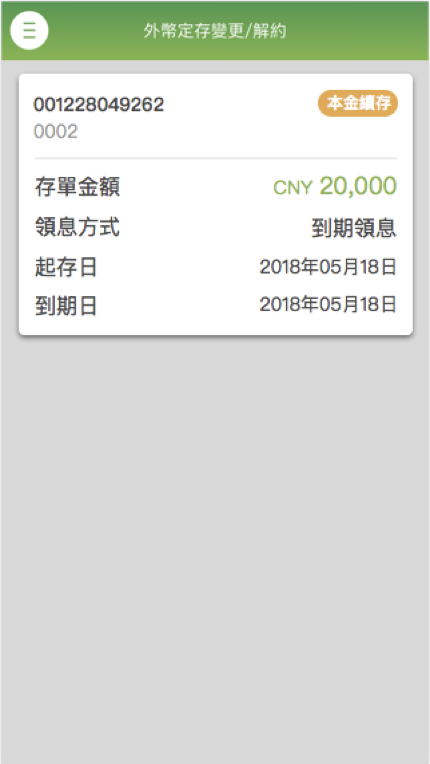
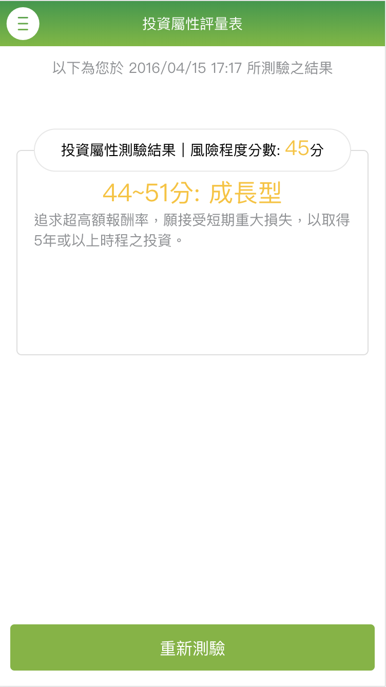
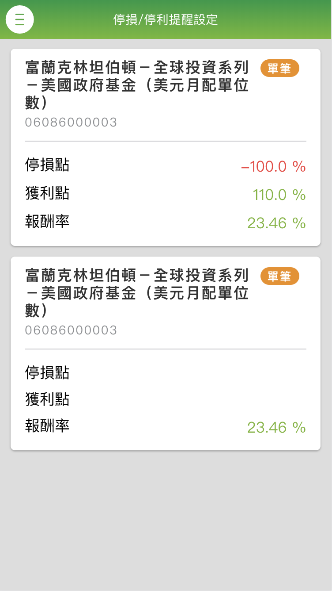
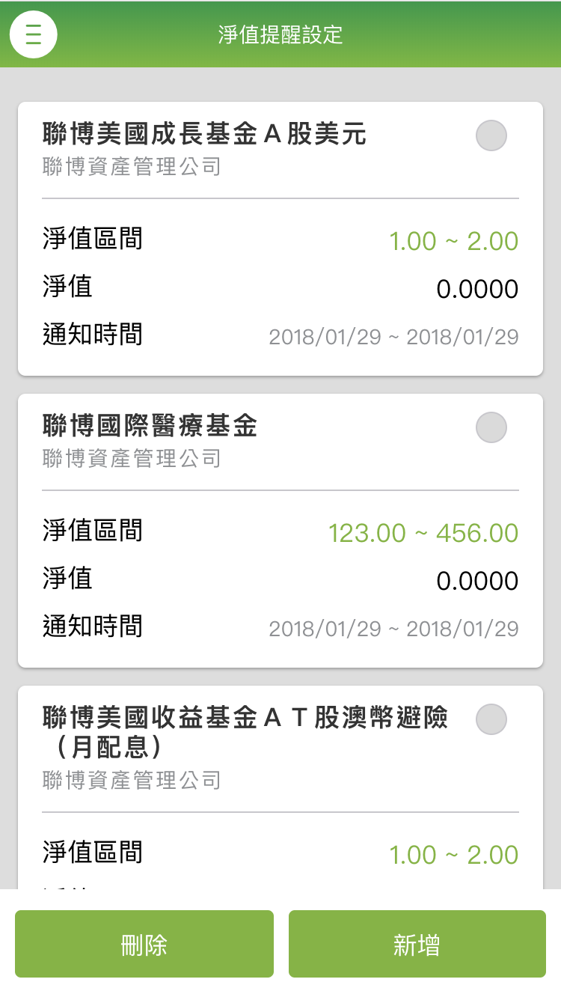
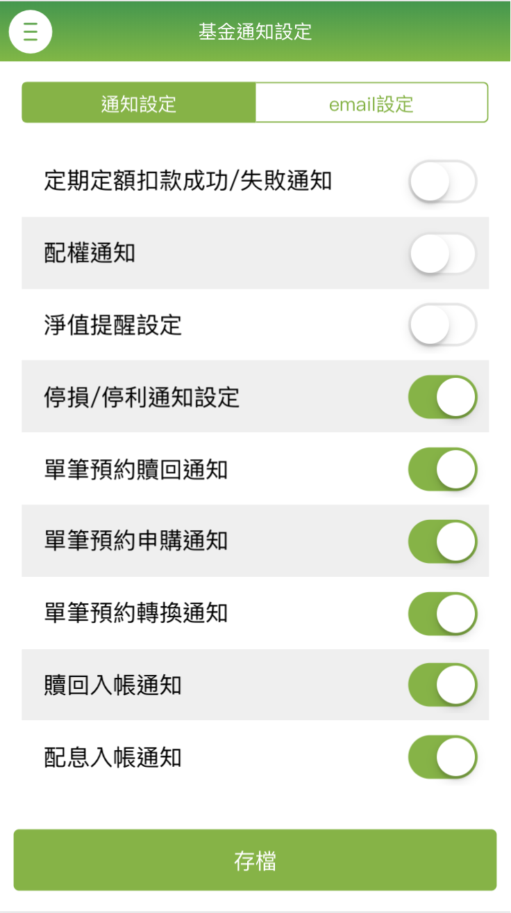

在碩士班期間，我參加了台灣微軟的未來生涯實習計畫，並被分派到 Microsoft Consulting Service 部門，參與銀行專案。
身為技術助理，我與專案成員一起開發個人行動網銀及個人網銀的部分功能。
由於我具備前端開發及 UI/UX 設計的能力，便被交付優化現行的行動網銀 UI/UX，並建立前端元件使用的規範。
後期在專案中也協助團隊修復了 Ionic framework 在 live reload 時速度過慢的問題，將原先需要 600 秒的編譯時間降低至 80 秒。

#### 負責：

1. 規劃前端元件使用規範，並且統一個人行動網銀設計語言。
2. 使用 Angular 開發個人網銀及行動網銀功能，包含：前端畫面切版及業務流程程式撰寫與 API 串接。
3. 排除 Ionic framework live reload 速度過慢的問題，將原先需要 600 秒的編譯時間降低至 80 秒。

### 使用技術：

1. Angular: 搭配 Ionic framework 作為前端組件庫，並使用 scss 進行部分元件的客製化。
2. Sketch: 匯出設計出的 UI 設計規範給團隊成員參考。

#### 作品截圖：

###### 尚未統一UI及規劃元件規範前

###### 統一UI及導入規劃元件規範後

##### 開發功能：

