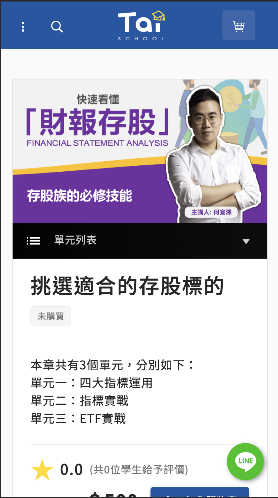

在學生時期，我常跟朋友一起接外包專案，除了磨練自己的技術以外，也可以接觸到業界的作業流程。
翔泰學校是一個以投資理財為主的影音教學網站，在這個專案中我和 UI/UX 設計師一起討論並依照設計規範開發前端網站，也利用 Swagger 作為 api 文件，同時我也嘗試使用.NET Core 撰寫一個 OTP(One Time Password)的服務。

#### 負責：

1. 使用 Angular 建立網站前端，並且依照設計稿開發元件及畫面，並串接金流。
2. 使用.NET 撰寫 OTP(One Time Password)服務，並提供前端 API 呼叫。
3. 提供使用者網站在手機、平板、iPad Pro 的解析度下能直覺操作的 RWD 設計。

#### 使用技術：
1. Angular: 使用 LazyLoad Module 建立前端畫面及元件，並且使用 Rx.js 串接後端 Api 及串接金流，利用 Router Guard 在前端進行權限驗證並阻擋沒有權限的使用者進入頁面。
2. .NET core: 建立 OTP(One Time Password)服務 API。

#### 作品截圖： 

